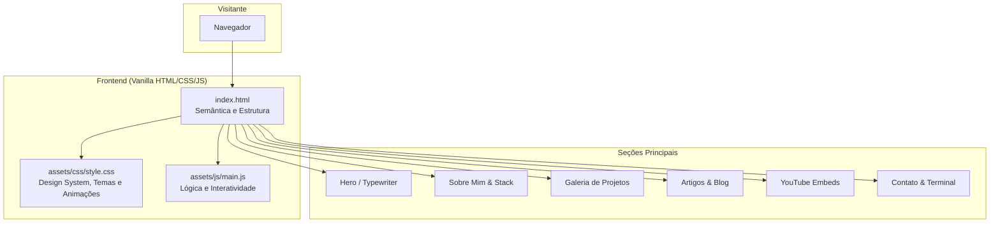

# Dev Portfolio - Gean De Araújo

Projeto do site de portfólio pessoal construído para demonstrar minha atuação como **AI Engineer & Developer**, destacando projetos práticos com **LLMs, Visão Computacional, Machine Learning e RAG**, além de artigos e vídeos do canal.

O site foi desenvolvido do zero com foco em performance, acessibilidade e design "hacker/cyber" utilizando HTML puro, CSS vanilla e JavaScript, sem dependência de frameworks pesados para o frontend.

---

## Projetos em Destaque

- **Totem Inteligente Interativo (IoT + IA)**
  Sistema interativo ponta a ponta com visão computacional, LLMs generativas e sensores IoT. O "cérebro" do totem analisa sentimentos, agrupa perfis e responde via chat e voz.

- **RAG Pipeline para Documentos Jurídicos**
  Sistema de perguntas e respostas sobre contratos e documentos legais usando LLMs open-source com recuperação contextual (Mistral 7B + FAISS + LangChain).

---

## Arquitetura do Portfólio



---

## Stack Técnica

### Do Portfólio
| Componente | Tecnologia |
|-----------|-----------|
| Estrutura | HTML5 |
| Estilização | CSS3 (Variáveis, Custom Properties, Animações) |
| Interatividade | Vanilla JavaScript |
| Deploy | GitHub Pages |

### Minha Stack Principal (Engenharia de IA)
| Área | Ferramentas |
|------|-------------|
| Linguagem | Python |
| Deep Learning | PyTorch, HuggingFace, Transformers |
| GenAI & LLMs | LangChain, Fine-tuning, RAG, Llama, Mistral |
| Machine Learning | Scikit-Learn, Pandas, NumPy |
| Backend & Deploy | FastAPI, Docker, SQL |

---

## Como Rodar Localmente

### Pré-requisitos
- Apenas um navegador web.

### Setup Rápido (Servidor Python)
Como o projeto é totalmente estático, você pode rodar qualquer servidor HTTP simples. Se tiver o Python instalado na máquina:

```bash
# Clone o repositório
git clone https://github.com/GeanDeAraujo/geandearaujo.github.io.git
cd geandearaujo.github.io

# Inicie um servidor local (Porta 8000)
python3 -m http.server 8000
```
Acesse **http://localhost:8000** no seu navegador.

### Extensão do VSCode
Você também pode usar a extensão **Live Server** no VSCode. Basta abrir o arquivo `index.html` e clicar em "Go Live".

---

## Estrutura do Repositório

```text
geandearaujo.github.io/
├── README.md               # Este arquivo
├── index.html              # Estrutura principal da página
└── assets/                 # Recursos e lógicas separadas
    ├── css/
    │   └── style.css       # Folha de estilos
    └── js/
        └── main.js         # Scripts e interações
```

---

## Contato e Redes

- **LinkedIn:** [linkedin.com/in/geandearaujo](https://linkedin.com/in/geandearaujo)
- **GitHub:** [github.com/GeanDeAraujo](https://github.com/GeanDeAraujo)
- **YouTube:** [youtube.com/@dearaujogean](https://youtube.com/@dearaujogean)
- **Email:** geanjfa@gmail.com
